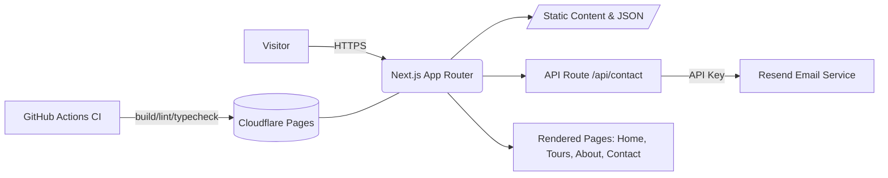

# Tima Green Tours — Fiji's Premier Eco-Cultural Tours

## Node Version
- Required Node: 22.x (LTS)
- Repo pinned via `.nvmrc` → `22`
- Recommended: use `nvm` (already configured)
  - `nvm use` (auto-picks 22)
  - `nvm install --lts` (if first time)

<!-- no-op: trigger push-based Cloudflare purge -->

## Vercel Build Settings
- Node version: `22.x` (tracked in `.vercel/project.json`)
- Build command: `npm run vercel:build`
  - Runs `npm run verify:node` to ensure Node versions align across `.nvmrc`, `package.json` engines, and Vercel
  - Then runs the regular `npm run build`


A fast, accessible, SEO-friendly website built with Next.js 14 + Tailwind.

## Tech
- Next.js 14 (App Router), TypeScript
- Tailwind CSS
- Optional contact email via Resend
- GitHub Actions CI
- Ready for Cloudflare Pages deploy

## Local Dev
```bash
npm i
cp env.example .env.local   # (optional for email)
npm run dev
```

## Deploy (Cloudflare Pages)
1. Push this repo to GitHub
2. Import to Cloudflare Pages → Framework: Next.js
3. (Optional) Add environment variables: RESEND_API_KEY, CONTACT_TO, CONTACT_FROM
4. Deploy

## Content Editing
- Update `/content/tours.json` for tour cards
- Edit copy in `app/page.tsx`, `app/about/page.tsx`, `app/contact/page.tsx`
- Replace `/public/og-default.jpg` with your own image

## KPIs (suggested)
- Inquiry submissions / day & per tour
- Conversion to booking (%)
- Avg. response time (SLA)
- Organic impressions & CTR (Search Console)
- Page speed (Core Web Vitals)

## Compliance & Privacy
- Avoid storing sensitive data; email only forwards inquiry details
- Add Privacy Policy & Terms pages before running paid campaigns
- Configure data retention in your inbox/CRM

## Roadmap
- Add individual tour pages by slug
- Multi-language (i18n) support
- CMS integration (Sanity/Contentlayer) if needed
- Analytics (Cloudflare Analytics / GA4)

---

## Small Utility Pages

### `app/favicon.ico`
*(Provide any 32×32 icon.)*

---

## Simple Architecture Diagram (for your wiki / README)



## Security & Ops Notes
- Use ENV variables only in server contexts (API route). Don't expose keys on the client
- Rate limiting isn't enabled by default—if spam appears, add a lightweight token (e.g., hCaptcha or a honeypot field)
- Add /privacy and /terms pages before scaling ad spend
- Keep Node ≥ 18 in CI and Cloudflare

## Cursor "Super Prompt" (optional)
Paste into Cursor before editing to maintain structure and style:
```
You are editing the "Tima Green Tours" Next.js app.
Goals: clean, accessible, fast. Maintain color tokens: brand.green #118a7e, brand.teal #17a2a0, brand.sand #f5efe6.
Constraints: App Router, Tailwind, TS strict. Keep components small and composable.
Tasks:
1) Write content in human, inviting tone (eco-cultural positioning).
2) Keep homepage lighthouse 95+ (no heavy libs).
3) Tours data from /content/tours.json. Consider adding dynamic [slug] pages later.
4) Contact via /api/contact using RESEND keys (optional); graceful fallback if missing.
Deliver: commit-ready changes with descriptive messages.
```

## How to Use
Create repo:
```bash
mkdir tima-green-tours && cd $_
# paste files as given into this structure or pull them down via your editor
npm i
npm run dev
```

Configure email (optional):
1. Get a Resend key → set RESEND_API_KEY, CONTACT_TO, CONTACT_FROM in Cloudflare Pages Project Settings → Environment Variables
2. Deploy: push to GitHub → import on Cloudflare Pages → deploy

---

If you'd like, I can also extend this with:
- Per-tour detail pages (/tours/[slug]) sourced from content/tours.json
- Sanity or Contentlayer to edit content without code
- HighLevel/HubSpot webhook to auto-create leads from the contact form

Say the word and I'll ship those enhancements in the same style.
